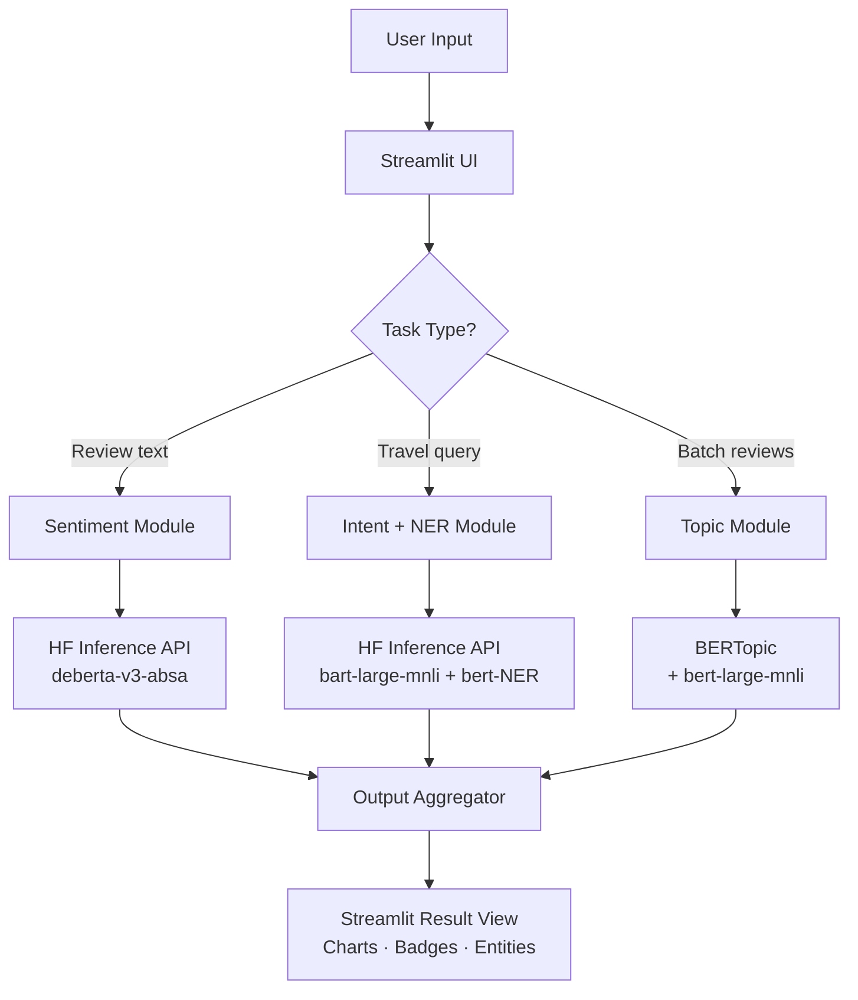

# MyTravelHelper — Kế hoạch Dự án Chi tiết

> **Phiên bản:** 1.0.0  
> **Ngày tạo:** 2026-05-24  
> **Trạng thái:** Draft → In Review  
> **Mục tiêu nộp:** Jupyter Notebook + Streamlit App hoàn chỉnh

---

## Mục lục

1. [Tổng quan dự án](#1-tổng-quan-dự-án)
2. [Phân tích yêu cầu](#2-phân-tích-yêu-cầu)
3. [Kiến trúc tổng quát](#3-kiến-trúc-tổng-quát)
4. [Lựa chọn & So sánh Model](#4-lựa-chọn--so-sánh-model)
5. [Thiết lập môi trường](#5-thiết-lập-môi-trường)
6. [Kế hoạch triển khai chi tiết](#6-kế-hoạch-triển-khai-chi-tiết)
7. [Cấu trúc Notebook](#7-cấu-trúc-notebook)
8. [Cấu trúc Streamlit App](#8-cấu-trúc-streamlit-app)
9. [Phần nâng cao — Advanced NLP](#9-phần-nâng-cao--advanced-nlp)
10. [Kiểm thử & Đánh giá chất lượng](#10-kiểm-thử--đánh-giá-chất-lượng)
11. [Rủi ro & Phương án dự phòng](#11-rủi-ro--phương-án-dự-phòng)
12. [Checklist nộp bài](#12-checklist-nộp-bài)

---

## 1. Tổng quan dự án

### 1.1 Mục tiêu

Xây dựng ứng dụng **MyTravelHelper** — một hệ thống NLP hỗ trợ du lịch, có khả năng:

- Phân tích cảm xúc (bao gồm phân tích theo khía cạnh) đối với review du lịch
- Phân loại ý định và trích xuất thực thể từ yêu cầu của người dùng
- Phát hiện và gán nhãn chủ đề tự động trong tập review

Toàn bộ quy trình được trình bày dưới dạng **Jupyter Notebook có thể tái hiện** (reproducible), giao diện người dùng xây dựng bằng **Streamlit**, và sử dụng **Hugging Face Inference Providers** để triệu gọi model.

### 1.2 Phạm vi

| Hạng mục | Trong phạm vi | Ngoài phạm vi |
|---|---|---|
| Ngôn ngữ xử lý | Tiếng Anh (chính), thử nghiệm tiếng Việt | Đa ngôn ngữ đầy đủ |
| Inference | HF Serverless Inference API | Self-hosted / local GPU |
| Dữ liệu | Sample reviews thủ công + dataset mẫu | Thu thập crawler từ TripAdvisor/Google |
| Đánh giá model | Định tính + bảng so sánh nhỏ | Fine-tuning, benchmark đầy đủ |
| Deployment | `streamlit run` local | Docker / cloud deployment |

### 1.3 Công nghệ sử dụng

```
Python 3.10+
├── jupyter / nbformat          ← trình bày notebook
├── streamlit >= 1.32           ← giao diện người dùng
├── huggingface_hub >= 0.22     ← InferenceClient
├── transformers >= 4.38        ← tokenizer local (nếu cần)
├── bertopic >= 0.16            ← topic modeling nâng cao
├── sentence-transformers       ← embedding cho BERTopic
├── plotly / altair             ← visualization
├── pandas / numpy              ← xử lý dữ liệu
└── python-dotenv               ← quản lý API token
```

---

## 2. Phân tích yêu cầu

### 2.1 Người dùng mục tiêu (Personas)

**Persona A — Du khách**
- Nhập câu hỏi / yêu cầu bằng ngôn ngữ tự nhiên ("Tôi muốn đặt khách sạn ở Đà Nẵng 3 đêm")
- Kỳ vọng hệ thống hiểu đúng ý định và trích xuất thông tin địa điểm, thời gian

**Persona B — Người quản lý du lịch**
- Dán vào tập review khách hàng
- Kỳ vọng nhận được phân tích cảm xúc theo từng khía cạnh (phòng, dịch vụ, giá cả…)
- Muốn biết những chủ đề nào đang được đề cập nhiều

### 2.2 Functional Requirements

| ID | Yêu cầu | Mức độ ưu tiên |
|---|---|---|
| FR-01 | Phân tích cảm xúc tổng thể (pos/neg/neutral) cho review | Must Have |
| FR-02 | Phân tích cảm xúc theo khía cạnh (ABSA) | Must Have |
| FR-03 | Phân loại ý định người dùng (booking, info, complaint…) | Must Have |
| FR-04 | Trích xuất thực thể: địa điểm, thời gian, số lượng | Must Have |
| FR-05 | Phát hiện chủ đề trong tập review | Must Have |
| FR-06 | Giao diện Streamlit đơn giản, trực quan | Must Have |
| FR-07 | Hiển thị confidence score cho từng kết quả | Should Have |
| FR-08 | Xử lý batch nhiều review cùng lúc | Nice to Have |
| FR-09 | Export kết quả phân tích ra CSV | Nice to Have |

### 2.3 Non-Functional Requirements

- **Latency:** Phản hồi trong vòng ≤ 5 giây / request (Serverless API phụ thuộc cold start)
- **Reliability:** Xử lý được lỗi API timeout, rate limit gracefully (retry + fallback message)
- **Reproducibility:** Chạy lại notebook từ đầu không bị lỗi
- **Readability:** Code có docstring, notebook có Markdown giải thích từng bước

---

## 3. Kiến trúc tổng quát

### 3.1 Pipeline Tổng quát

```
┌─────────────────────────────────────────────────────────┐
│                    NGƯỜI DÙNG                           │
│          (Review text / Travel query)                   │
└────────────────────┬────────────────────────────────────┘
                     │
                     ▼
┌─────────────────────────────────────────────────────────┐
│                  STREAMLIT UI                           │
│  ┌─────────────┐  ┌──────────────┐  ┌───────────────┐  │
│  │  Tab: ABSA  │  │ Tab: Intent  │  │ Tab: Topics   │  │
│  └─────────────┘  └──────────────┘  └───────────────┘  │
└────────────────────┬────────────────────────────────────┘
                     │
                     ▼
┌─────────────────────────────────────────────────────────┐
│           HUGGING FACE INFERENCE PROVIDERS              │
│                  InferenceClient                        │
│         (Serverless Endpoints, API Token)               │
└──────┬────────────────┬─────────────────┬───────────────┘
       │                │                 │
       ▼                ▼                 ▼
┌────────────┐  ┌──────────────┐  ┌─────────────────┐
│  SENTIMENT │  │  INTENT+NER  │  │ TOPIC DETECTION │
│   MODULE   │  │    MODULE    │  │     MODULE      │
└────────────┘  └──────────────┘  └─────────────────┘
       │                │                 │
       ▼                ▼                 ▼
┌─────────────────────────────────────────────────────────┐
│                 OUTPUT AGGREGATOR                       │
│      Post-processing · Label mapping · Confidence      │
└────────────────────┬────────────────────────────────────┘
                     │
                     ▼
┌─────────────────────────────────────────────────────────┐
│               STREAMLIT RESULT VIEW                     │
│    Charts · Badges · Highlighted entities · Wordcloud  │
└─────────────────────────────────────────────────────────┘
```

### 3.2 Data Flow Chi tiết

```
Input Text
    │
    ├──[Task 1: Review]──► Preprocessor ──► DeBERTa-ABSA
    │                                            │
    │                              ┌─────────────┴───────────────┐
    │                              │  aspect: {food, room, ...}  │
    │                              │  sentiment: {pos/neg/neu}   │
    │                              └─────────────────────────────┘
    │
    ├──[Task 2: Query]───► Tokenizer ──► BART zero-shot (Intent)
    │                           │           + BERT-NER (Entities)
    │                           │
    │                    ┌──────┴─────────────────────────────┐
    │                    │  intent: book_hotel / find_place   │
    │                    │  entities: {LOC, DATE, QUANTITY}   │
    │                    └────────────────────────────────────┘
    │
    └──[Task 3: Batch]───► Sentence Embeddings ──► BERTopic
                                                       │
                                              ┌────────┴────────┐
                                              │ topic_id: label │
                                              │ representative  │
                                              │ words per topic │
                                              └─────────────────┘
```

### 3.3 Module Dependencies

```
app.py (Streamlit)
├── modules/sentiment.py
│   └── deps: huggingface_hub, InferenceClient
├── modules/intent_ner.py
│   └── deps: huggingface_hub, InferenceClient
├── modules/topic.py
│   └── deps: bertopic, sentence-transformers, huggingface_hub
└── utils/
    ├── preprocessing.py   ← text cleaning, truncation
    └── display.py         ← Streamlit component helpers
```

---

## 4. Lựa chọn & So sánh Model

### 4.1 Task 1 — Phân tích cảm xúc + ABSA

**Yêu cầu:** Không chỉ cho biết review tích cực/tiêu cực mà còn phải chỉ ra *khía cạnh nào* tích cực, *khía cạnh nào* tiêu cực.

**Ví dụ mong đợi:**
```
Input: "The room was spotless but the staff was incredibly rude."
Output:
  - aspect: room       → sentiment: POSITIVE (confidence: 0.94)
  - aspect: staff      → sentiment: NEGATIVE (confidence: 0.97)
```

| Model | Kiến trúc | Tác vụ | Ưu điểm | Nhược điểm | Kết luận |
|---|---|---|---|---|---|
| `distilbert-base-uncased-finetuned-sst-2-english` | DistilBERT | Sentiment (2 nhãn) | Siêu nhẹ (67M), nhanh | Chỉ pos/neg, không có aspect | ❌ Không đủ |
| `cardiffnlp/twitter-roberta-base-sentiment-latest` | RoBERTa | Sentiment (3 nhãn) | Bao gồm neutral, dữ liệu thực tế | Không có aspect | ⚠️ Dùng làm baseline |
| `yangheng/deberta-v3-base-absa-v1.1` | DeBERTa-v3 | **ABSA** | Đúng tác vụ, phân tích theo aspect, state-of-the-art trên SemEval | Nặng hơn (~184M), cần truyền aspect prompt | ✅ **Chọn cho Advanced** |

**Quyết định:** Dùng `distilbert-sst2` cho phần demo cơ bản (phần 5 test môi trường), `deberta-v3-absa` cho phần nâng cao.

---

### 4.2 Task 2 — Phân loại ý định & Trích xuất thực thể

**Yêu cầu:** Từ câu như "Book me a hotel in Hội An for 2 nights next Friday", hệ thống phải:
1. Nhận ra ý định: `book_hotel`
2. Trích xuất: `location=Hội An`, `duration=2 nights`, `date=next Friday`

#### 4.2.1 Model Intent Classification

| Model | Phương pháp | Nhãn intent | Ưu điểm | Nhược điểm |
|---|---|---|---|---|
| `facebook/bart-large-mnli` | Zero-shot classification | Tự định nghĩa | Linh hoạt, không cần fine-tune | Chậm hơn, ~400M params |
| `cross-encoder/nli-MiniLM2-L6-H768` | Zero-shot (nhẹ) | Tự định nghĩa | Nhanh, đủ tốt | Độ chính xác thấp hơn BART |
| `qanastek/XLMRoberta-Large-Intent-Classification` | Fine-tuned intent | 60 nhãn cố định | Nhanh, chính xác | Nhãn cố định, không tùy biến |

**Chọn cho advanced:** `facebook/bart-large-mnli` với label tự định nghĩa:
```python
candidate_labels = [
    "book hotel", "find restaurant", "get directions",
    "check weather", "find attraction", "make complaint",
    "request information", "cancel booking"
]
```

#### 4.2.2 Model Named Entity Recognition (NER)

| Model | Entities | F1 Score | Ưu điểm | Nhược điểm |
|---|---|---|---|---|
| `dslim/bert-base-NER` | PER, ORG, LOC, MISC | 91.3 (CoNLL-03) | Nhanh, ổn định, nhẹ (~110M) | Không có DATE, QUANTITY |
| `dslim/bert-large-NER` | PER, ORG, LOC, MISC | 92.8 | Tốt hơn base | Nặng hơn (~340M) |
| `Jean-Baptiste/roberta-large-ner-english` | PER, ORG, LOC, MISC | 94.0 | SOTA | Nặng, chậm |
| `Babelscape/rebel-large` | 200+ quan hệ | — | Trích xuất quan hệ phong phú | Quá phức tạp cho tác vụ này |

**Chọn:** `dslim/bert-base-NER` (NER chuẩn) + post-processing thêm rule-based để bắt DATE/QUANTITY.

---

### 4.3 Task 3 — Phát hiện chủ đề

**Yêu cầu:** Từ tập review, tự động khám phá các chủ đề đang được đề cập ("giá phòng", "vị trí", "đồ ăn sáng", "nhân viên lễ tân"...).

| Phương pháp | Cơ chế | Ưu điểm | Nhược điểm | Kết luận |
|---|---|---|---|---|
| LDA (sklearn) | Probabilistic | Không cần GPU, dễ hiểu | Chất lượng kém trên text ngắn, cần tiền xử lý nhiều | ❌ Chỉ dùng baseline |
| `facebook/bart-large-mnli` zero-shot | NLI | Label định nghĩa sẵn, không cần training | Phải biết trước chủ đề muốn tìm | ⚠️ Tốt khi biết domain |
| **BERTopic** (`MaartenGr/BERTopic`) | BERT + UMAP + HDBSCAN | Tự cluster, không cần label, visualization đẹp | Cần batch ≥ 10 docs để có kết quả tốt | ✅ **Chọn cho Advanced** |

**Chiến lược kết hợp (advanced):**
```
Tập reviews
    │
    ▼
BERTopic.fit_transform()          ← khám phá topic tự động (unsupervised)
    │
    ▼
Topic ID + representative words   ← ví dụ: ["room", "clean", "bed", "bathroom"]
    │
    ▼
BART-MNLI zero-shot               ← gán tên tự nhiên cho topic
    │                                ví dụ: "room cleanliness"
    ▼
Named topics + review assignment
```

---

## 5. Thiết lập môi trường

### 5.1 Yêu cầu hệ thống

```
OS: Windows 10/11, macOS 12+, Ubuntu 20.04+
Python: 3.10 hoặc 3.11 (khuyến nghị 3.11)
RAM: Tối thiểu 8GB (khuyến nghị 16GB cho BERTopic)
Internet: Bắt buộc (gọi HF Inference API)
```

### 5.2 Thiết lập Hugging Face Inference Providers

**Bước 1: Tạo HF Token**
```
1. Truy cập https://huggingface.co/settings/tokens
2. Tạo token mới → Role: "Read" là đủ cho Inference API
3. Copy token → lưu vào file .env
```

**Bước 2: Cài đặt dependencies**
```bash
# Tạo virtual environment
python -m venv .venv
source .venv/bin/activate      # Linux/macOS
.venv\Scripts\activate         # Windows

# Cài packages
pip install -r requirements.txt
```

**Bước 3: Cấu hình token**
```bash
# File .env (KHÔNG commit file này lên Git)
HF_TOKEN=hf_xxxxxxxxxxxxxxxxxxxxxxxxxxxxxxxx
```

**Bước 4: Test kết nối**
```python
import os
from huggingface_hub import InferenceClient
from dotenv import load_dotenv

load_dotenv()
client = InferenceClient(token=os.getenv("HF_TOKEN"))

# Quick test với model nhỏ
result = client.text_classification(
    "The hotel was absolutely amazing!",
    model="distilbert-base-uncased-finetuned-sst-2-english"
)
print(result)  # [ClassificationOutput(label='POSITIVE', score=0.9998...)]
```

### 5.3 Giải thích Inference Providers

| Loại | Mô tả | Khi nào dùng | Chi phí |
|---|---|---|---|
| **Serverless** | Triệu gọi model theo request, không cần deploy | Học tập, prototype, throughput thấp | Miễn phí trong giới hạn, sau đó tính theo token |
| **Dedicated Endpoints** | Deploy riêng model lên cloud, luôn warm | Production, latency yêu cầu thấp | ~$0.06–$0.50/giờ tùy GPU |
| **Inference Providers** (3rd party) | Router tới AWS Bedrock, Azure, Groq… | Khi cần model không có trên HF | Theo pricing của provider |

> **Quyết định cho bài tập này:** Dùng **Serverless Inference** — miễn phí, không cần cấu hình, đủ cho mục đích học tập và demo.

---

## 6. Kế hoạch triển khai chi tiết

### Sprint 1 — Foundation (Ưu tiên cao nhất)

**Mục tiêu:** Có pipeline cơ bản chạy được end-to-end

| Task | Mô tả | Thời gian | Output |
|---|---|---|---|
| T1.1 | Tạo cấu trúc project, setup `.env`, `requirements.txt` | 30 phút | Project scaffold |
| T1.2 | Viết phần 1 notebook: mục tiêu, phân tích yêu cầu | 45 phút | Notebook cells 1-10 |
| T1.3 | Vẽ sơ đồ pipeline (Mermaid trong notebook) | 60 phút | Pipeline diagram |
| T1.4 | Thiết lập HF Inference + test cơ bản | 60 phút | `InferenceClient` working |
| T1.5 | Bảng so sánh model (viết ra notebook) | 90 phút | Model comparison table |

### Sprint 2 — Core Features

**Mục tiêu:** Ba tác vụ NLP cơ bản hoạt động trong Streamlit

| Task | Mô tả | Thời gian | Output |
|---|---|---|---|
| T2.1 | `modules/sentiment.py` — basic sentiment | 45 phút | `analyze_sentiment()` |
| T2.2 | `modules/intent_ner.py` — zero-shot intent + NER | 60 phút | `classify_intent()`, `extract_entities()` |
| T2.3 | `modules/topic.py` — zero-shot topic với BART | 45 phút | `detect_topics()` |
| T2.4 | `app.py` — Streamlit UI với 3 tab | 90 phút | Running Streamlit app |
| T2.5 | Test cơ bản, chụp màn hình / quay video | 30 phút | Evidence chạy được |

### Sprint 3 — Advanced Features

**Mục tiêu:** Nâng cao đúng yêu cầu đề bài

| Task | Mô tả | Thời gian | Output |
|---|---|---|---|
| T3.1 | ABSA với `deberta-v3-absa` | 90 phút | Aspect-level sentiment |
| T3.2 | Intent + NER pipeline kết hợp, hiển thị đẹp | 60 phút | Combined NLU output |
| T3.3 | BERTopic + auto-labeling với BART | 120 phút | Topic modeling với tên tự động |
| T3.4 | Visualization: wordcloud, bar chart, confidence | 60 phút | Plotly/Altair charts |
| T3.5 | Hoàn thiện notebook, viết commentary | 60 phút | Polished notebook |

### Sprint 4 — Polish & Submit

| Task | Mô tả | Thời gian |
|---|---|---|
| T4.1 | Review lại toàn bộ notebook, fix typo, thêm giải thích | 60 phút |
| T4.2 | Đảm bảo notebook chạy `Restart & Run All` không lỗi | 30 phút |
| T4.3 | Viết README.md cho project | 30 phút |
| T4.4 | Kiểm tra checklist nộp bài | 15 phút |

---

## 7. Cấu trúc Notebook

```
MyTravelHelper_Notebook.ipynb
│
├── [PHẦN 1] — Mục tiêu & Phân tích yêu cầu
│   ├── [Markdown] Giới thiệu bài toán
│   ├── [Markdown] Personas + Use cases
│   └── [Markdown] Functional & Non-functional requirements
│
├── [PHẦN 2] — Kiến trúc tổng quát
│   ├── [Markdown] Mermaid pipeline diagram
│   ├── [Markdown] Mô tả từng thành phần
│   └── [Markdown] Data flow giữa các module
│
├── [PHẦN 3] — Thiết lập Hugging Face Inference
│   ├── [Code] pip install + import
│   ├── [Code] Load token từ .env
│   ├── [Code] Khởi tạo InferenceClient
│   ├── [Markdown] Giải thích Serverless vs Dedicated
│   └── [Code] Test kết nối (health check)
│
├── [PHẦN 4] — Giới thiệu & So sánh Model
│   ├── [Markdown] Bảng so sánh Task 1 (Sentiment)
│   ├── [Markdown] Bảng so sánh Task 2 (Intent + NER)
│   ├── [Markdown] Bảng so sánh Task 3 (Topics)
│   └── [Markdown] Tổng kết model được chọn + lý do
│
├── [PHẦN 5] — Test cơ bản môi trường
│   ├── [Code] Test Sentiment model
│   ├── [Code] Test NER model
│   ├── [Code] Test Zero-shot Classification
│   └── [Code] Kiểm tra latency từng model
│
├── [PHẦN 6] — Chạy ứng dụng & Kiểm thử
│   ├── [Markdown] Hướng dẫn chạy: `streamlit run app.py`
│   ├── [Code/Markdown] Demo từng tính năng inline trong notebook
│   └── [Markdown] Kết quả kiểm thử với 5+ test cases
│
└── [PHẦN 7] — Phần nâng cao
    ├── [7.1] ABSA — DeBERTa aspect-based sentiment
    │   ├── [Code] Gọi deberta-v3-absa
    │   ├── [Code] Parse output theo aspect
    │   └── [Code] Visualization kết quả
    ├── [7.2] Intent + NER kết hợp
    │   ├── [Code] BART zero-shot intent
    │   ├── [Code] BERT NER entities
    │   └── [Code] Hợp nhất kết quả, hiển thị highlight
    └── [7.3] BERTopic Topic Detection
        ├── [Code] Load sample reviews
        ├── [Code] BERTopic fit + transform
        ├── [Code] BART auto-label topics
        └── [Code] Plotly visualization
```

---

## 8. Cấu trúc Streamlit App

### 8.1 Cấu trúc file

```
MyTravelHelper/
├── app.py                          ← Entry point Streamlit
├── modules/
│   ├── __init__.py
│   ├── sentiment.py                ← Sentiment + ABSA
│   ├── intent_ner.py               ← Intent + NER
│   └── topic.py                    ← Topic Detection
├── utils/
│   ├── preprocessing.py            ← Text cleaning
│   └── display.py                  ← Streamlit UI helpers
├── data/
│   └── sample_reviews.json         ← 20-30 review mẫu
├── .env                            ← HF_TOKEN (gitignored)
├── .gitignore
├── requirements.txt
└── README.md
```

### 8.2 Layout Streamlit

```
┌─────────────────────────────────────┐
│  🌏 MyTravelHelper                  │
│  Sidebar: API status, settings      │
├─────────────────────────────────────┤
│  Tab 1 | Tab 2 | Tab 3              │
│  [Sentiment] [Intent/NER] [Topics]  │
├─────────────────────────────────────┤
│                                     │
│  [Input area]                       │
│  [Analyze button]                   │
│                                     │
│  [Results display]                  │
│                                     │
└─────────────────────────────────────┘
```

### 8.3 API mỗi module

```python
# modules/sentiment.py
def analyze_sentiment(text: str, mode: str = "basic") -> dict:
    """
    mode="basic"    → dùng distilbert-sst2, trả về {label, score}
    mode="absa"     → dùng deberta-v3-absa, trả về [{aspect, sentiment, score}]
    """

# modules/intent_ner.py
def classify_intent(text: str, candidate_labels: list[str]) -> dict:
    """Trả về {intent, confidence}"""

def extract_entities(text: str) -> list[dict]:
    """Trả về [{word, entity_type, score, start, end}]"""

# modules/topic.py
def detect_topics_zeroshot(text: str, topics: list[str]) -> dict:
    """Trả về {topic, score} cho single text"""

def detect_topics_bertopic(docs: list[str]) -> tuple[list, object]:
    """Trả về (topic_ids, fitted_model) cho batch docs"""
```

---

## 9. Phần nâng cao — Advanced NLP

### 9.1 ABSA — Aspect-Based Sentiment Analysis

**Model:** `yangheng/deberta-v3-base-absa-v1.1`

**Cơ chế:** Model này nhận vào cặp `(review, aspect)` và dự đoán sentiment cho aspect đó. Cần loop qua các aspect được định nghĩa sẵn cho domain du lịch.

```python
TRAVEL_ASPECTS = [
    "room", "cleanliness", "staff", "service",
    "location", "food", "price", "wifi", "pool"
]

def analyze_absa(review: str) -> list[dict]:
    results = []
    for aspect in TRAVEL_ASPECTS:
        # Model nhận input: f"[CLS] {review} [SEP] {aspect} [SEP]"
        output = client.text_classification(
            f"{review} [SEP] {aspect}",
            model="yangheng/deberta-v3-base-absa-v1.1"
        )
        if output[0].score > 0.6:  # chỉ giữ kết quả có confidence cao
            results.append({
                "aspect": aspect,
                "sentiment": output[0].label,
                "confidence": round(output[0].score, 3)
            })
    return results
```

**Visualization:** Bảng màu — xanh lá cho POSITIVE, đỏ cho NEGATIVE, xám cho NEUTRAL, với thanh confidence.

---

### 9.2 Intent Classification + NER Pipeline

**Luồng xử lý:**
```
Input query
    │
    ├──► BART zero-shot ──► intent label + confidence
    │
    └──► BERT NER ──────── entity spans
                               │
                               └── post-process: merge B-/I- tokens,
                                   map LOC→location, DATE→time, etc.
```

**Intent labels cho travel domain:**
```python
TRAVEL_INTENTS = {
    "book hotel":        "Đặt phòng khách sạn",
    "find restaurant":   "Tìm nhà hàng",
    "get directions":    "Hỏi đường / chỉ đường",
    "check weather":     "Hỏi thời tiết",
    "find attraction":   "Tìm điểm tham quan",
    "cancel booking":    "Hủy đặt chỗ",
    "make complaint":    "Phản ánh / khiếu nại",
    "request info":      "Hỏi thông tin chung",
}
```

---

### 9.3 BERTopic — Topic Detection

**Pipeline:**
```python
from bertopic import BERTopic
from sentence_transformers import SentenceTransformer

# Bước 1: Embedding
embedding_model = SentenceTransformer("all-MiniLM-L6-v2")

# Bước 2: Fit BERTopic
topic_model = BERTopic(
    embedding_model=embedding_model,
    min_topic_size=2,              # phù hợp dataset nhỏ (demo)
    nr_topics="auto"
)
topics, probs = topic_model.fit_transform(reviews)

# Bước 3: Lấy representative words
topic_info = topic_model.get_topic_info()

# Bước 4: Auto-label với BART zero-shot
for topic_id in topic_info["Topic"].unique():
    if topic_id == -1: continue   # -1 là outlier topic
    words = [w for w, _ in topic_model.get_topic(topic_id)[:5]]
    # Dùng BART để đặt tên topic từ representative words
```

**Visualization:**
- `topic_model.visualize_topics()` → interactive Plotly scatter
- `topic_model.visualize_barchart()` → top words per topic
- Wordcloud per topic (nếu có `wordcloud` package)

---

## 10. Kiểm thử & Đánh giá chất lượng

### 10.1 Test Cases mẫu

**Task 1 — Sentiment:**
```
Input: "The location was perfect but the breakfast was disappointing."
Expected ABSA:
  location  → POSITIVE ✓
  breakfast → NEGATIVE ✓
```

**Task 2 — Intent + NER:**
```
Input: "I need a 5-star hotel in Da Nang for 3 nights starting December 20th"
Expected:
  intent:   book_hotel (confidence > 0.85)
  entities: Da Nang (LOC), 3 nights (QUANTITY), December 20th (DATE)
```

**Task 3 — Topics:**
```
Input: [10+ reviews về khách sạn]
Expected topics: room quality, food quality, staff service, location, price value
```

### 10.2 Edge Cases cần xử lý

| Tình huống | Xử lý |
|---|---|
| Text quá dài (> 512 tokens) | Truncate + cảnh báo user |
| API timeout | Retry 2 lần, sau đó hiển thị lỗi thân thiện |
| Rate limit HF free tier | `time.sleep(1)` giữa các request, thông báo |
| Text trống | Validate trước khi gọi API |
| Model cold start (first request chậm) | Loading spinner + thông báo "Đang khởi động model…" |

---

## 11. Rủi ro & Phương án dự phòng

| Rủi ro | Khả năng | Tác động | Phương án dự phòng |
|---|---|---|---|
| HF Serverless API quá tải / xuống | Trung bình | Cao | Chuẩn bị mock response JSON để demo offline |
| `deberta-v3-absa` không available trên HF Serverless | Thấp | Cao | Fallback sang `cardiffnlp/twitter-roberta` |
| BERTopic tốn RAM > 8GB | Thấp | Trung bình | Dùng `min_topic_size=5`, giảm dataset |
| Cold start > 30 giây | Cao | Thấp | Thêm loading state, giải thích trong notebook |
| Token HF hết quota | Trung bình | Cao | Tạo sẵn 2 token backup |

---

## 12. Checklist nộp bài

### Notebook

- [ ] Notebook chạy `Restart & Run All` hoàn toàn không lỗi
- [ ] Có đầy đủ 7 phần với Markdown giải thích
- [ ] Phần 2 có sơ đồ pipeline rõ ràng (Mermaid hoặc hình ảnh)
- [ ] Phần 4 có bảng so sánh ≥ 3 model mỗi task với lý do chọn
- [ ] Phần 7 có cả 3 tác vụ nâng cao với output minh họa
- [ ] Output cells đã được chạy và hiển thị kết quả (không để trống)

### Streamlit App

- [ ] `streamlit run app.py` chạy không lỗi
- [ ] Có đủ 3 tab tương ứng 3 tác vụ
- [ ] Xử lý được lỗi API gracefully
- [ ] Hiển thị confidence score

### Project

- [ ] `requirements.txt` đầy đủ và đúng version
- [ ] `.env.example` có (không có `.env` thật)
- [ ] `.gitignore` bao gồm `.env`, `__pycache__`, `.venv`
- [ ] `README.md` có hướng dẫn setup và chạy ứng dụng

---

## Phụ lục A — requirements.txt

```txt
# Core
streamlit>=1.32.0
huggingface_hub>=0.22.0
python-dotenv>=1.0.0

# NLP
transformers>=4.38.0
sentence-transformers>=2.6.0
bertopic>=0.16.0

# Visualization
plotly>=5.20.0
altair>=5.3.0
wordcloud>=1.9.3

# Data
pandas>=2.2.0
numpy>=1.26.0

# Utilities
tenacity>=8.2.0    # retry logic cho API calls
```

## Phụ lục B — Mermaid Diagram (dán vào Notebook)

````markdown

````

---

*Tài liệu này được cập nhật theo tiến độ thực hiện. Phiên bản mới nhất tại `docs/project_plan.md`.*
