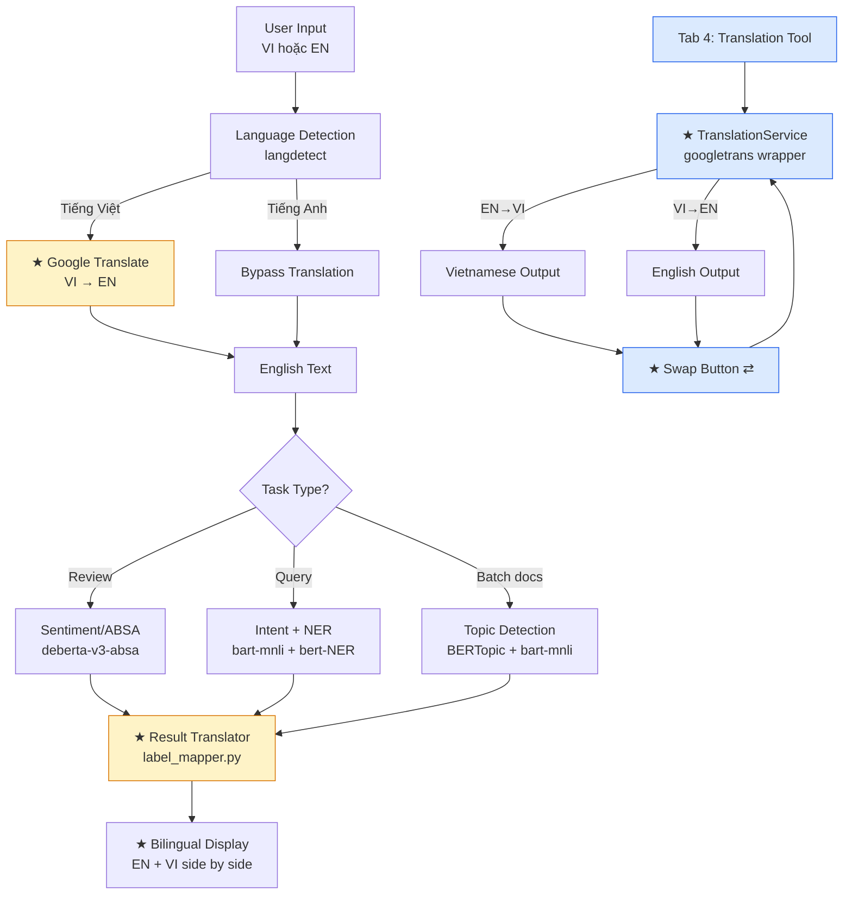

# MyTravelHelper v2.0 — Kế hoạch Nâng cấp Đa ngôn ngữ

> **Phiên bản:** 2.0.0 (nâng cấp từ v1.0 — Tuần 09)
> **Ngày tạo:** 2026-05-26
> **Trạng thái:** Planning
> **Mục tiêu nộp:** Jupyter Notebook + Streamlit App có hỗ trợ tiếng Việt

---

## Mục lục

1. [Tổng quan & Mục tiêu nâng cấp](#1-tổng-quan--mục-tiêu-nâng-cấp)
2. [Phân tích yêu cầu](#2-phân-tích-yêu-cầu)
3. [Kiến trúc tổng quát](#3-kiến-trúc-tổng-quát)
4. [Thiết lập Google Translate API](#4-thiết-lập-google-translate-api)
5. [Test cơ bản môi trường](#5-test-cơ-bản-môi-trường)
6. [Kế hoạch triển khai chi tiết](#6-kế-hoạch-triển-khai-chi-tiết)
7. [Cấu trúc Notebook](#7-cấu-trúc-notebook)
8. [Cấu trúc Streamlit App v2](#8-cấu-trúc-streamlit-app-v2)
9. [Phần nâng cao — Multilingual NLP](#9-phần-nâng-cao--multilingual-nlp)
10. [Kiểm thử & Đánh giá chất lượng](#10-kiểm-thử--đánh-giá-chất-lượng)
11. [Rủi ro & Phương án dự phòng](#11-rủi-ro--phương-án-dự-phòng)
12. [So sánh v1.0 vs v2.0](#12-so-sánh-v10-vs-v20)
13. [Checklist nộp bài](#13-checklist-nộp-bài)

---

## 1. Tổng quan & Mục tiêu nâng cấp

### 1.1 Bối cảnh

Phiên bản v1.0 (Tuần 09) đã xây dựng được pipeline NLP cơ bản với ba tác vụ: phân tích cảm xúc (ABSA), phân loại ý định + NER, và phát hiện chủ đề. Tuy nhiên, toàn bộ hệ thống chỉ hoạt động với **tiếng Anh** — đây là giới hạn lớn khi người dùng mục tiêu là du khách Việt Nam.

Phiên bản v2.0 giải quyết hạn chế này bằng cách tích hợp **Google Translate API** như một lớp dịch thuật trung gian, cho phép:

- Người dùng nhập liệu bằng **tiếng Việt**
- Hệ thống tự động dịch sang tiếng Anh → chạy NLP model → dịch kết quả trở lại
- Có công cụ dịch thuật **tự do 2 chiều** English ↔ Vietnamese

### 1.2 Mục tiêu cụ thể

| # | Mục tiêu | Baseline v1.0 | Target v2.0 |
|---|---|---|---|
| 1 | Input language | Tiếng Anh only | **Tiếng Việt + Tiếng Anh** |
| 2 | ABSA | Tiếng Anh | **Tiếng Việt input, EN pipeline** |
| 3 | Intent + NER | Tiếng Anh | **Tiếng Việt input, EN pipeline** |
| 4 | Topic Detection | Tiếng Anh | **Tiếng Việt input, EN pipeline** |
| 5 | Translation tool | Không có | **Tab dịch EN ↔ VI tự do** |
| 6 | Translation engine | Không có | **Google Translate API** |

### 1.3 Chiến lược kiến trúc: "Translate-then-Process"

Thay vì thay thế toàn bộ model NLP bằng model đa ngôn ngữ (phức tạp, tốn chi phí), v2.0 áp dụng chiến lược **Translate-then-Process**:

```
[Tiếng Việt] → Google Translate (VI→EN) → [NLP Model EN] → [Kết quả EN] → Google Translate (EN→VI) → [Hiển thị tiếng Việt]
```

**Ưu điểm:** Tái sử dụng 100% model đã chọn ở v1.0, không cần fine-tune lại.
**Nhược điểm:** Thêm 2 lần gọi API Translate → tăng latency, phụ thuộc chất lượng dịch.

---

## 2. Phân tích yêu cầu

### 2.1 Phân tích thay đổi so với v1.0

```
v1.0 Features (GIỮ NGUYÊN)          v2.0 New Features (THÊM MỚI)
─────────────────────────────        ────────────────────────────────
✓ Sentiment basic (EN)          →    + Multilingual wrapper (VI input)
✓ ABSA - DeBERTa (EN)           →    + VI→EN translation layer
✓ Intent Classification (EN)    →    + EN→VI result translation
✓ NER Extraction (EN)           →    + Language detection
✓ BERTopic (EN)                 →    + VI batch input support
✓ Streamlit 3-tab UI            →    + Tab 4: Translation tool (EN↔VI)
─────────────────────────────        + google-cloud-translate setup
                                     + deepl/googletrans fallback
```

### 2.2 Functional Requirements v2.0

| ID | Yêu cầu | Loại | Mức độ ưu tiên |
|---|---|---|---|
| FR-V01 | Nhận input tiếng Việt cho tác vụ ABSA | New | Must Have |
| FR-V02 | Nhận input tiếng Việt cho tác vụ Intent+NER | New | Must Have |
| FR-V03 | Nhận input tiếng Việt cho tác vụ Topic Detection | New | Must Have |
| FR-V04 | Tab dịch thuật tự do EN↔VI với hoán đổi ngôn ngữ | New | Must Have |
| FR-V05 | Tự động phát hiện ngôn ngữ input (VI hay EN) | New | Should Have |
| FR-V06 | Hiển thị cả bản gốc lẫn bản dịch trong kết quả | New | Should Have |
| FR-V07 | Dịch ngược nhãn kết quả sang tiếng Việt | New | Should Have |
| FR-V08 | Hỗ trợ batch dịch nhiều review cùng lúc | New | Nice to Have |
| FR-V09 | Cache bản dịch để tránh gọi API lặp | New | Nice to Have |

### 2.3 Non-Functional Requirements (cập nhật)

| Thuộc tính | v1.0 | v2.0 |
|---|---|---|
| Latency / request | ≤ 5s | ≤ **8s** (thêm 2 lần translate) |
| Ngôn ngữ hỗ trợ | EN | **VI + EN** |
| API phụ thuộc | HF Inference | HF Inference + **Google Translate** |
| Chi phí dự kiến | Free (HF Serverless) | Free tier + Google Translate ($0 cho 500K chars/tháng đầu) |

### 2.4 So sánh các Translate API

| API | Thư viện Python | Miễn phí | Chất lượng VI↔EN | Độ ổn định | Kết luận |
|---|---|---|---|---|---|
| **Google Cloud Translation** | `google-cloud-translate` | 500K chars/tháng | ⭐⭐⭐⭐⭐ | Production-grade | ✅ **Chọn chính** |
| **googletrans (unofficial)** | `googletrans==4.0.0-rc1` | Miễn phí hoàn toàn | ⭐⭐⭐⭐ | ⚠️ Hay bị block | ✅ **Fallback / dev** |
| **DeepL API** | `deepl` | 500K chars/tháng | ⭐⭐⭐⭐ (yếu VI) | Tốt | ❌ Yếu tiếng Việt |
| **Azure Translator** | `azure-ai-translation-text` | $10 credit | ⭐⭐⭐⭐ | Tốt | ❌ Cần thẻ ngân hàng |
| **LibreTranslate** | `libretranslate` | Tự host | ⭐⭐⭐ | Phụ thuộc host | ❌ Chất lượng thấp |

> **Quyết định:** Dùng **`googletrans`** (không cần API key) cho development/demo, **Google Cloud Translation API** cho production. Notebook hướng dẫn cả hai, người dùng chọn tùy nhu cầu.

---

## 3. Kiến trúc tổng quát

### 3.1 Pipeline Tổng quát v2.0

```
┌──────────────────────────────────────────────────────────────────┐
│                        NGƯỜI DÙNG                               │
│              (Tiếng Việt HOẶC Tiếng Anh)                        │
└──────────────────────────┬───────────────────────────────────────┘
                           │
                           ▼
┌──────────────────────────────────────────────────────────────────┐
│                      STREAMLIT UI v2.0                          │
│  ┌──────────┐  ┌──────────┐  ┌──────────┐  ┌───────────────┐   │
│  │ Tab 1    │  │ Tab 2    │  │ Tab 3    │  │  Tab 4 ★NEW   │   │
│  │ ABSA     │  │ Intent   │  │ Topics   │  │  Translation  │   │
│  │ (VI/EN)  │  │ (VI/EN)  │  │ (VI/EN)  │  │  EN ↔ VI      │   │
│  └──────────┘  └──────────┘  └──────────┘  └───────────────┘   │
└──────────────────────────┬───────────────────────────────────────┘
                           │
                           ▼
┌──────────────────────────────────────────────────────────────────┐
│              ★ LANGUAGE DETECTION LAYER (NEW)                   │
│         langdetect / googletrans.detect()                       │
│         → is_vietnamese: bool                                   │
└────────┬─────────────────────────────────────────┬──────────────┘
         │ if Vietnamese                            │ if English
         ▼                                         ▼
┌─────────────────────┐                 ┌──────────────────────┐
│ ★ TRANSLATE LAYER   │                 │  (bypass translate)  │
│  Google Translate   │                 └──────────┬───────────┘
│  VI → EN            │                            │
└──────────┬──────────┘                            │
           └──────────────────┬────────────────────┘
                              │ English text
                              ▼
┌──────────────────────────────────────────────────────────────────┐
│              HUGGING FACE INFERENCE PROVIDERS                   │
│      (Giống v1.0 — không thay đổi model NLP core)               │
├────────────────┬──────────────────┬──────────────────────────────┤
│ SENTIMENT/ABSA │  INTENT + NER    │    TOPIC DETECTION           │
│ deberta-v3     │  bart-mnli +     │    BERTopic +                │
│ -absa          │  bert-base-NER   │    bart-mnli labels          │
└───────┬────────┴────────┬─────────┴──────────┬───────────────────┘
        │                 │                    │
        └─────────────────┴────────────────────┘
                          │ English results
                          ▼
┌──────────────────────────────────────────────────────────────────┐
│              ★ RESULT TRANSLATION LAYER (NEW)                   │
│   - Dịch label names sang tiếng Việt (static mapping)           │
│   - Dịch aspect names sang tiếng Việt                           │
│   - Dịch topic words sang tiếng Việt                            │
└──────────────────────────┬───────────────────────────────────────┘
                           │
                           ▼
┌──────────────────────────────────────────────────────────────────┐
│                  STREAMLIT RESULT VIEW                          │
│   Hiển thị song ngữ: bản gốc (EN) + bản dịch (VI)              │
│   Charts · Badges (VI) · Entities highlighted · Topics         │
└──────────────────────────────────────────────────────────────────┘
```

### 3.2 Data Flow Chi tiết — Multilingual

```
[VI Input] "Phòng rất sạch nhưng nhân viên thô lỗ"
     │
     ▼ Language Detection
     is_vi = True
     │
     ▼ Google Translate VI→EN
     "The room is very clean but the staff is rude"
     │
     ├──► ABSA (deberta-v3-absa)
     │         ├── aspect: room    → POSITIVE (0.97)
     │         └── aspect: staff   → NEGATIVE (0.95)
     │              │
     │              ▼ Result Translation (EN→VI labels)
     │         ├── khía cạnh: phòng   → TÍCH CỰC (0.97)
     │         └── khía cạnh: nhân viên → TIÊU CỰC (0.95)
     │
     └──► [Final Display: song ngữ VI + EN]
```

```
[VI Input] "Tôi muốn đặt khách sạn 4 sao ở Đà Nẵng 2 đêm"
     │
     ▼ Google Translate VI→EN
     "I want to book a 4-star hotel in Da Nang for 2 nights"
     │
     ├──► Intent: book_hotel (0.94) → "đặt khách sạn"
     └──► NER: Da Nang (LOC), 4-star (MISC), 2 nights (QUANTITY)
                   │
                   ▼ Post-process: giữ tên riêng gốc tiếng Việt
              Đà Nẵng (ĐỊA ĐIỂM), 4 sao (LOẠI), 2 đêm (SỐ LƯỢNG)
```

### 3.3 Tab 4 — Translation Tool Flow

```
┌─────────────────────────────────────────┐
│           Tab 4: Dịch thuật             │
│                                         │
│  [Source Lang ▼]  ⇄  [Target Lang ▼]   │
│   English             Vietnamese        │
│                                         │
│  ┌─────────────────────────────────┐    │
│  │ Nhập văn bản nguồn...          │    │
│  └─────────────────────────────────┘    │
│                                         │
│           [Dịch ngay]                   │
│                                         │
│  ┌─────────────────────────────────┐    │
│  │ Kết quả dịch...                │    │
│  └─────────────────────────────────┘    │
│                                         │
│  [Copy kết quả]  [Hoán đổi ⇄]         │
└─────────────────────────────────────────┘

Hoán đổi button logic:
  - Swap source_lang ↔ target_lang
  - Move translated text → source text box
  - Clear target text box
  - Auto-trigger new translation
```

### 3.4 Module Dependencies v2.0

```
app.py (Streamlit v2.0)
├── modules/
│   ├── sentiment.py          [UPDATED] + VI wrapper
│   ├── intent_ner.py         [UPDATED] + VI wrapper
│   ├── topic.py              [UPDATED] + VI wrapper
│   └── translation.py        [NEW] Google Translate integration
├── utils/
│   ├── preprocessing.py      [UPDATED] + VI text cleaning
│   ├── language_detect.py    [NEW] langdetect wrapper
│   ├── label_mapper.py       [NEW] EN→VI label translation
│   └── display.py            [UPDATED] bilingual display
└── config/
    ├── vi_labels.json         [NEW] static EN→VI label mapping
    └── travel_aspects_vi.json [NEW] VI aspect definitions
```

---

## 4. Thiết lập Google Translate API

### 4.1 Hai lựa chọn tích hợp

#### Lựa chọn A — `googletrans` (Không cần API key — Khuyến nghị cho demo)

```bash
pip install googletrans==4.0.0-rc1
```

```python
from googletrans import Translator, LANGUAGES

translator = Translator()

# Dịch VI → EN
result = translator.translate("Phòng rất sạch", src="vi", dest="en")
print(result.text)        # "The room is very clean"
print(result.src)         # "vi"
print(result.dest)        # "en"

# Phát hiện ngôn ngữ
detected = translator.detect("Nhân viên rất thân thiện")
print(detected.lang)      # "vi"
print(detected.confidence) # 0.98
```

> **Lưu ý:** `googletrans` dùng API không chính thức của Google Translate web. Không cần API key nhưng có thể bị rate limit nếu gọi quá nhiều. Phù hợp cho demo và học tập.

#### Lựa chọn B — Google Cloud Translation API (Production)

**Bước 1: Tạo Google Cloud Project**
```
1. Truy cập https://console.cloud.google.com
2. Tạo project mới: "mytravelhelper-translate"
3. Enable API: "Cloud Translation API"
4. Tạo Service Account → Download JSON key
```

**Bước 2: Cài đặt**
```bash
pip install google-cloud-translate==3.15.0
```

**Bước 3: Cấu hình credentials**
```bash
# Thêm vào .env
GOOGLE_APPLICATION_CREDENTIALS=path/to/service-account-key.json
# HOẶC dùng API Key đơn giản hơn:
GOOGLE_TRANSLATE_API_KEY=AIza...
```

**Bước 4: Sử dụng**
```python
from google.cloud import translate_v2 as translate
import os
from dotenv import load_dotenv

load_dotenv()

# Khởi tạo client
client = translate.Client()

# Dịch văn bản
result = client.translate(
    "Khách sạn rất đẹp và thoáng mát",
    source_language="vi",
    target_language="en"
)
print(result["translatedText"])  # "The hotel is very beautiful and airy"
print(result["detectedSourceLanguage"])  # "vi"

# Batch translation (hiệu quả hơn nhiều request đơn lẻ)
texts = ["Phòng sạch", "Giá hợp lý", "Dịch vụ tốt"]
results = client.translate(texts, target_language="en")
for r in results:
    print(r["translatedText"])
```

### 4.2 Wrapper class thống nhất

Để dễ dàng chuyển đổi giữa hai lựa chọn, xây dựng một wrapper chung:

```python
# modules/translation.py

import os
from typing import Literal

class TranslationService:
    """
    Wrapper thống nhất cho Google Translate.
    Backend: 'googletrans' (no API key) hoặc 'google_cloud' (API key).
    """

    def __init__(self, backend: Literal["googletrans", "google_cloud"] = "googletrans"):
        self.backend = backend
        self._init_client()

    def _init_client(self):
        if self.backend == "googletrans":
            from googletrans import Translator
            self._client = Translator()
        elif self.backend == "google_cloud":
            from google.cloud import translate_v2
            self._client = translate_v2.Client()

    def translate(self, text: str, src: str = "vi", dest: str = "en") -> str:
        """Dịch văn bản. Trả về chuỗi đã dịch."""
        if not text.strip():
            return text
        try:
            if self.backend == "googletrans":
                result = self._client.translate(text, src=src, dest=dest)
                return result.text
            elif self.backend == "google_cloud":
                result = self._client.translate(
                    text,
                    source_language=src,
                    target_language=dest
                )
                return result["translatedText"]
        except Exception as e:
            raise TranslationError(f"Translation failed: {e}") from e

    def detect_language(self, text: str) -> tuple[str, float]:
        """Trả về (language_code, confidence). Ví dụ: ('vi', 0.98)"""
        try:
            if self.backend == "googletrans":
                detected = self._client.detect(text)
                return detected.lang, detected.confidence
            elif self.backend == "google_cloud":
                result = self._client.detect_language(text)
                return result["language"], result["confidence"]
        except Exception:
            return "en", 0.0  # fallback to English

    def batch_translate(self, texts: list[str], src: str = "vi", dest: str = "en") -> list[str]:
        """Dịch nhiều văn bản cùng lúc (hiệu quả hơn gọi lặp)."""
        if not texts:
            return []
        if self.backend == "google_cloud":
            results = self._client.translate(texts, source_language=src, target_language=dest)
            return [r["translatedText"] for r in results]
        else:
            # googletrans không hỗ trợ batch tốt, loop từng cái
            return [self.translate(t, src, dest) for t in texts]


class TranslationError(Exception):
    pass
```

### 4.3 Bảng so sánh hai cách thiết lập

| Tiêu chí | `googletrans` (A) | Google Cloud API (B) |
|---|---|---|
| API Key | ❌ Không cần | ✅ Cần tạo project GCP |
| Giới hạn miễn phí | Không chính thức (~100 req/giờ) | 500,000 ký tự/tháng chính thức |
| Độ ổn định | ⚠️ Thỉnh thoảng bị block | ✅ Production-grade SLA |
| Cài đặt | `pip install googletrans` | `pip install google-cloud-translate` + JSON key |
| Phù hợp | Demo, học tập, bài tập | Sản phẩm thực tế |
| Setup time | 2 phút | 15–20 phút |

> **Quyết định cho bài tập:** Notebook hướng dẫn **cả hai**, mặc định dùng `googletrans` để chạy ngay không cần setup. Người dùng có thể chuyển sang Google Cloud bằng cách đổi `backend="google_cloud"`.

---

## 5. Test cơ bản môi trường

### 5.1 Cấu trúc bộ test cơ bản

```python
# === TEST 1: Kiểm tra cài đặt ===
def test_installation():
    packages = [
        "googletrans", "google.cloud.translate",
        "langdetect", "huggingface_hub", "streamlit"
    ]
    for pkg in packages:
        try:
            __import__(pkg.replace(".", "_"))
            print(f"✅ {pkg}")
        except ImportError:
            print(f"❌ {pkg} — chưa cài")

# === TEST 2: Dịch đơn giản VI→EN ===
def test_basic_translation():
    translator = TranslationService(backend="googletrans")
    cases = [
        ("Phòng rất sạch sẽ", "en"),
        ("The hotel was amazing", "vi"),
        ("Dịch vụ tệ hại", "en"),
    ]
    for text, dest in cases:
        result = translator.translate(text, dest=dest)
        print(f"[{'VI→EN' if dest=='en' else 'EN→VI'}] {text!r}")
        print(f"  → {result!r}\n")

# === TEST 3: Phát hiện ngôn ngữ ===
def test_language_detection():
    translator = TranslationService()
    samples = [
        "Khách sạn đẹp lắm",          # VI
        "The room was spotless",        # EN
        "Nice location, great food",    # EN
        "Vị trí tốt, giá cả hợp lý",   # VI
    ]
    for s in samples:
        lang, conf = translator.detect_language(s)
        label = "🇻🇳 VI" if lang == "vi" else "🇺🇸 EN"
        print(f"{label} ({conf:.2f}) | {s!r}")

# === TEST 4: Batch dịch ===
def test_batch_translation():
    reviews_vi = [
        "Phòng sạch, nhân viên thân thiện",
        "Vị trí đắc địa, gần biển",
        "Giá hơi cao nhưng xứng đáng",
    ]
    translator = TranslationService()
    results = translator.batch_translate(reviews_vi, src="vi", dest="en")
    for vi, en in zip(reviews_vi, results):
        print(f"VI: {vi}")
        print(f"EN: {en}\n")

# === TEST 5: Tích hợp Translation + NLP ===
def test_translate_then_nlp():
    text_vi = "Phòng khách sạn rất sạch nhưng nhân viên khá thô lỗ"
    translator = TranslationService()
    text_en = translator.translate(text_vi, src="vi", dest="en")
    print(f"Original (VI): {text_vi}")
    print(f"Translated (EN): {text_en}")

    # Sau đó chạy sentiment như v1.0
    from huggingface_hub import InferenceClient
    client = InferenceClient(token=os.getenv("HF_TOKEN"))
    result = client.text_classification(
        text_en,
        model="distilbert-base-uncased-finetuned-sst-2-english"
    )
    print(f"Sentiment: {result[0].label} ({result[0].score:.3f})")
```

### 5.2 Checklist test môi trường

| Test | Kết quả mong đợi | Trạng thái |
|---|---|---|
| `import googletrans` | Không lỗi | ⬜ |
| Dịch VI→EN đơn giản | Văn bản tiếng Anh có nghĩa | ⬜ |
| Dịch EN→VI đơn giản | Văn bản tiếng Việt có nghĩa | ⬜ |
| Phát hiện ngôn ngữ VI | `lang='vi'`, confidence > 0.9 | ⬜ |
| Phát hiện ngôn ngữ EN | `lang='en'`, confidence > 0.9 | ⬜ |
| Batch dịch 5 câu | 5 kết quả đúng thứ tự | ⬜ |
| Translate + HF sentiment | Sentiment hợp lý | ⬜ |
| Streamlit chạy app v2 | Không lỗi import | ⬜ |

---

## 6. Kế hoạch triển khai chi tiết

### Sprint 1 — Translation Foundation

| Task | Mô tả | Thời gian |
|---|---|---|
| T1.1 | Setup `googletrans` + test kết nối | 20 phút |
| T1.2 | Viết `TranslationService` wrapper class | 45 phút |
| T1.3 | Viết `LanguageDetector` utility | 30 phút |
| T1.4 | Viết `vi_labels.json` — mapping nhãn EN→VI | 30 phút |
| T1.5 | Test suite 5 bộ test cơ bản, ghi kết quả vào notebook | 30 phút |

### Sprint 2 — Nâng cấp 3 NLP Modules

| Task | Mô tả | Thời gian |
|---|---|---|
| T2.1 | Nâng cấp `sentiment.py` — thêm VI wrapper | 45 phút |
| T2.2 | Nâng cấp `intent_ner.py` — VI input + entity post-process | 60 phút |
| T2.3 | Nâng cấp `topic.py` — batch VI input support | 60 phút |
| T2.4 | Viết `label_mapper.py` — dịch kết quả sang VI | 30 phút |
| T2.5 | Test từng module với 5 câu tiếng Việt mẫu | 45 phút |

### Sprint 3 — Streamlit UI v2.0

| Task | Mô tả | Thời gian |
|---|---|---|
| T3.1 | Thêm Tab 4: Translation tool với hoán đổi EN↔VI | 60 phút |
| T3.2 | Thêm language selector vào Tab 1, 2, 3 | 30 phút |
| T3.3 | Update result display: hiển thị song ngữ | 45 phút |
| T3.4 | Thêm loading states & error handling cho translate | 30 phút |
| T3.5 | Chạy app, kiểm thử 10 test cases VI + EN | 45 phút |

### Sprint 4 — Polish & Notebook

| Task | Mô tả | Thời gian |
|---|---|---|
| T4.1 | Viết đầy đủ commentary notebook 7 phần | 60 phút |
| T4.2 | Chạy `Restart & Run All` — fix lỗi nếu có | 30 phút |
| T4.3 | Cập nhật README.md và requirements.txt | 20 phút |
| T4.4 | Kiểm tra checklist, chuẩn bị nộp | 15 phút |

---

## 7. Cấu trúc Notebook

```
MyTravelHelper_v2_Multilingual.ipynb
│
├── [PHẦN 1] — Mục tiêu & Phân tích yêu cầu
│   ├── [Markdown] Bối cảnh nâng cấp từ v1.0
│   ├── [Markdown] Bảng so sánh v1.0 vs v2.0
│   ├── [Markdown] Chiến lược "Translate-then-Process"
│   └── [Markdown] Functional requirements mới
│
├── [PHẦN 2] — Kiến trúc tổng quát
│   ├── [Markdown] Mermaid pipeline v2.0 (có highlight phần mới)
│   ├── [Markdown] Data flow VI input qua từng bước
│   ├── [Markdown] Tab 4 Translation tool flow
│   └── [Markdown] Module dependency graph
│
├── [PHẦN 3] — Thiết lập Google Translate API
│   ├── [Code] pip install googletrans
│   ├── [Markdown] Hướng dẫn Option A: googletrans
│   ├── [Code] Test Option A
│   ├── [Markdown] Hướng dẫn Option B: Google Cloud API
│   ├── [Code] Khởi tạo với Google Cloud (conditional)
│   ├── [Code] TranslationService wrapper class
│   └── [Markdown] So sánh hai lựa chọn
│
├── [PHẦN 4] — Test cơ bản môi trường
│   ├── [Code] Test 1: Kiểm tra cài đặt packages
│   ├── [Code] Test 2: Dịch đơn VI→EN và EN→VI
│   ├── [Code] Test 3: Language detection
│   ├── [Code] Test 4: Batch translation
│   └── [Code] Test 5: Translate + NLP end-to-end
│
├── [PHẦN 5] — Chạy ứng dụng & Kiểm thử cơ bản
│   ├── [Markdown] Hướng dẫn chạy: streamlit run app.py
│   ├── [Code] Demo inline: Tab 1, 2, 3 với VI input
│   ├── [Code] Demo inline: Tab 4 Translation
│   └── [Markdown] Kết quả kiểm thử 10 test cases
│
└── [PHẦN 6] — Phần nâng cao
    ├── [6.1] ABSA tiếng Việt
    │   ├── [Code] VI input → Translate → DeBERTa ABSA → VI results
    │   ├── [Code] Hiển thị kết quả song ngữ
    │   └── [Code] Visualization với nhãn tiếng Việt
    ├── [6.2] Intent + NER tiếng Việt
    │   ├── [Code] VI input → Translate → BART intent → map VI
    │   ├── [Code] NER với tên địa danh Việt Nam giữ nguyên
    │   └── [Code] Hiển thị highlight entities song ngữ
    ├── [6.3] Topic Detection tiếng Việt
    │   ├── [Code] Batch VI reviews → Translate batch → BERTopic
    │   ├── [Code] Auto-label topics → Dịch sang VI
    │   └── [Code] Visualization với tên chủ đề tiếng Việt
    └── [6.4] Translation Tool EN↔VI
        ├── [Code] Demo hoán đổi ngôn ngữ
        ├── [Code] Xử lý edge cases (ngôn ngữ lẫn lộn)
        └── [Code] Đo độ trễ và chất lượng dịch
```

---

## 8. Cấu trúc Streamlit App v2

### 8.1 Cấu trúc file cập nhật

```
MyTravelHelper/
├── app.py                              [UPDATED] + Tab 4, language toggle
├── modules/
│   ├── __init__.py
│   ├── sentiment.py                    [UPDATED] + VI multilingual wrapper
│   ├── intent_ner.py                   [UPDATED] + VI multilingual wrapper
│   ├── topic.py                        [UPDATED] + VI batch translate
│   └── translation.py                  [NEW] TranslationService class
├── utils/
│   ├── preprocessing.py                [UPDATED] + Vietnamese text cleaning
│   ├── language_detect.py              [NEW] LanguageDetector class
│   ├── label_mapper.py                 [NEW] EN↔VI label translation
│   └── display.py                      [UPDATED] bilingual result display
├── config/
│   ├── vi_labels.json                  [NEW] static EN→VI mappings
│   └── travel_aspects_vi.json          [NEW] Vietnamese aspect definitions
├── data/
│   ├── sample_reviews_en.json          [EXISTING]
│   └── sample_reviews_vi.json          [NEW] 15–20 review tiếng Việt mẫu
├── .env
├── requirements.txt                    [UPDATED]
└── README.md                           [UPDATED]
```

### 8.2 `vi_labels.json` — Mapping nhãn

```json
{
  "sentiment": {
    "POSITIVE": "TÍCH CỰC",
    "NEGATIVE": "TIÊU CỰC",
    "NEUTRAL":  "TRUNG LẬP"
  },
  "intent": {
    "book hotel":       "đặt khách sạn",
    "find restaurant":  "tìm nhà hàng",
    "get directions":   "hỏi đường",
    "check weather":    "hỏi thời tiết",
    "find attraction":  "tìm điểm tham quan",
    "cancel booking":   "hủy đặt chỗ",
    "make complaint":   "phản ánh/khiếu nại",
    "request info":     "hỏi thông tin"
  },
  "aspects": {
    "room":        "phòng",
    "cleanliness": "vệ sinh",
    "staff":       "nhân viên",
    "service":     "dịch vụ",
    "location":    "vị trí",
    "food":        "đồ ăn",
    "price":       "giá cả",
    "wifi":        "wifi",
    "pool":        "hồ bơi"
  },
  "entity_types": {
    "LOC":      "ĐỊA ĐIỂM",
    "PER":      "CON NGƯỜI",
    "ORG":      "TỔ CHỨC",
    "DATE":     "THỜI GIAN",
    "QUANTITY": "SỐ LƯỢNG",
    "MISC":     "KHÁC"
  }
}
```

### 8.3 Logic hoán đổi ngôn ngữ Tab 4

```python
# Trong app.py — Tab 4
with tab_translate:
    col1, col_swap, col2 = st.columns([5, 1, 5])

    with col1:
        src_lang = st.selectbox("Ngôn ngữ nguồn", ["Tiếng Việt 🇻🇳", "Tiếng Anh 🇺🇸"],
                                 key="src_lang")
        src_text = st.text_area("Nhập văn bản", height=200, key="src_text")

    with col_swap:
        st.write("")
        st.write("")
        if st.button("⇄", help="Hoán đổi ngôn ngữ"):
            # Swap logic
            st.session_state["src_lang"] = st.session_state.get("tgt_lang", "Tiếng Anh 🇺🇸")
            st.session_state["tgt_lang"] = src_lang
            # Move translated text to source if available
            if "translated_text" in st.session_state:
                st.session_state["src_text"] = st.session_state["translated_text"]
            st.rerun()

    with col2:
        tgt_lang = st.selectbox("Ngôn ngữ đích", ["Tiếng Anh 🇺🇸", "Tiếng Việt 🇻🇳"],
                                 key="tgt_lang")
        translated = st.session_state.get("translated_text", "")
        st.text_area("Bản dịch", value=translated, height=200, disabled=True)

    if st.button("🌐 Dịch ngay", type="primary"):
        src_code = "vi" if "Việt" in src_lang else "en"
        tgt_code = "en" if "Anh" in tgt_lang else "vi"
        with st.spinner("Đang dịch..."):
            result = translator.translate(src_text, src=src_code, dest=tgt_code)
            st.session_state["translated_text"] = result
            st.rerun()
```

---

## 9. Phần nâng cao — Multilingual NLP

### 9.1 ABSA tiếng Việt (2 điểm)

**Luồng xử lý:**
```
[VI review] → Translate VI→EN → DeBERTa ABSA (EN) → Map labels VI → [VI results]
```

**Xử lý đặc thù tiếng Việt:**
- Tiếng Việt có nhiều cách viết tắt/slang: "sạch bóng", "ổn áp", "khá oke" → Google Translate xử lý được
- Tên địa danh (Đà Nẵng, Hội An…) → không dịch, giữ nguyên
- Dấu thanh Việt đôi khi bị mất khi dịch → thêm bước `unicodedata.normalize`

**Sample reviews tiếng Việt cho test:**
```python
VI_ABSA_SAMPLES = [
    "Phòng rất sạch sẽ và thoáng mát, nhưng nhân viên lễ tân không thân thiện lắm.",
    "Vị trí tuyệt vời, ngay trung tâm thành phố. Bữa sáng phong phú và ngon.",
    "Giá phòng hơi cao so với chất lượng, wifi rất chậm và hay mất kết nối.",
    "Hồ bơi đẹp, dịch vụ spa tuyệt vời. Nhân viên rất nhiệt tình và chuyên nghiệp.",
]
```

**Output mong đợi (song ngữ):**
```
Input VI:  "Phòng rất sạch sẽ nhưng nhân viên không thân thiện"
Trans EN:  "The room is very clean but the staff is not friendly"

Kết quả ABSA:
  🟢 phòng (room)       → TÍCH CỰC / POSITIVE  (0.96)
  🔴 nhân viên (staff)  → TIÊU CỰC / NEGATIVE  (0.94)
```

---

### 9.2 Intent + NER tiếng Việt (2 điểm)

**Thách thức đặc thù:**
- Tên địa danh Việt Nam (Hà Nội, Phú Quốc, Mũi Né) phải được NER nhận ra sau khi dịch sang EN
- Sau khi NER extract entities từ EN, cần **map ngược về tên gốc tiếng Việt**

**Chiến lược Name Preservation:**
```python
def extract_entities_vi(text_vi: str) -> list[dict]:
    # Bước 1: Lưu các proper nouns tiếng Việt
    from googletrans import Translator
    t = Translator()

    # Bước 2: Dịch sang EN
    text_en = t.translate(text_vi, src="vi", dest="en").text

    # Bước 3: Chạy NER trên EN
    entities_en = extract_entities(text_en)

    # Bước 4: Map entities EN về VI bằng alignment
    # (tìm vị trí entity EN trong EN text → tìm vị trí tương ứng trong VI text)
    # Đây là phần thú vị nhất để trình bày trong notebook!

    return entities_vi
```

**Sample queries tiếng Việt:**
```python
VI_INTENT_SAMPLES = [
    "Tôi muốn đặt khách sạn 4 sao ở Đà Nẵng cho 2 người, 3 đêm từ thứ 6 tuần tới",
    "Cho tôi biết nhà hàng hải sản ngon gần bãi biển Mỹ Khê",
    "Tôi cần hủy đặt phòng tại Resort Furama vào ngày 20 tháng 12",
    "Thời tiết ở Sapa tháng 1 có lạnh không?",
    "Đường đi từ sân bay Tân Sơn Nhất đến quận 1 mất bao lâu?",
]
```

---

### 9.3 Topic Detection tiếng Việt (2 điểm)

**Thách thức:** BERTopic yêu cầu batch documents. Với tiếng Việt, cần translate tất cả trước khi fit.

```python
def detect_topics_vi(reviews_vi: list[str]) -> dict:
    """
    Nhận batch review tiếng Việt, trả về topics với tên tiếng Việt.
    """
    # Bước 1: Batch translate VI→EN
    translator = TranslationService()
    reviews_en = translator.batch_translate(reviews_vi, src="vi", dest="en")

    # Bước 2: BERTopic trên EN
    topic_model = BERTopic(min_topic_size=2, nr_topics="auto")
    topics, probs = topic_model.fit_transform(reviews_en)

    # Bước 3: Lấy topic info
    topic_info = topic_model.get_topic_info()

    # Bước 4: Auto-label với BART (EN)
    # Bước 5: Dịch tên topic sang VI
    topic_labels_en = auto_label_topics(topic_model)
    topic_labels_vi = {
        tid: translator.translate(label, src="en", dest="vi")
        for tid, label in topic_labels_en.items()
    }

    return {
        "topics": topics,
        "topic_labels_vi": topic_labels_vi,
        "model": topic_model,
        "reviews_en": reviews_en  # hiển thị bản dịch để người dùng kiểm tra
    }
```

**Sample reviews tiếng Việt cho BERTopic:**
```python
VI_REVIEWS_BATCH = [
    "Phòng rộng rãi, sạch sẽ, view biển tuyệt đẹp",
    "Nhân viên thân thiện và nhiệt tình hỗ trợ",
    "Bữa sáng buffet rất phong phú và ngon miệng",
    "Giá phòng hơi cao nhưng xứng đáng với chất lượng",
    "Vị trí thuận tiện, gần trung tâm mua sắm",
    "Hồ bơi sạch, khu vực thư giãn yên tĩnh",
    "Dịch vụ phòng chậm, phải chờ khá lâu",
    "WiFi mạnh và ổn định trong suốt kỳ nghỉ",
    "Nhân viên lễ tân chuyên nghiệp, check-in nhanh",
    "Đồ ăn sáng có nhiều lựa chọn, café ngon",
    # ... thêm để BERTopic hoạt động tốt hơn
]
```

---

### 9.4 Translation Tool EN↔VI (2 điểm)

**Các tính năng chi tiết:**

| Tính năng | Mô tả | Độ khó |
|---|---|---|
| Dịch EN→VI | Nhập EN, nhận VI | Cơ bản |
| Dịch VI→EN | Nhập VI, nhận EN | Cơ bản |
| Hoán đổi ⇄ | Swap ngôn ngữ + nội dung | Trung bình |
| Auto-detect | Tự nhận diện ngôn ngữ input | Trung bình |
| Character count | Đếm ký tự input/output | Đơn giản |
| Copy to clipboard | Copy kết quả 1 click | Đơn giản |

**Edge cases cần xử lý:**
```python
EDGE_CASES = {
    "mixed_language": "Tôi muốn check-in sớm vào hotel",  # lẫn EN trong VI
    "numbers_dates":  "Đặt phòng ngày 25/12/2025",         # date format
    "proper_nouns":   "Đi từ Hà Nội đến Ho Chi Minh City", # địa danh
    "empty_input":    "",                                   # input trống
    "very_long":      "..." * 500,                          # quá dài
    "special_chars":  "Phòng đẹp!!! 😍🌟✨",               # emoji
}
```

---

## 10. Kiểm thử & Đánh giá chất lượng

### 10.1 Test Matrix — Multilingual

| Test Case | Input | Expected Output | Pass/Fail |
|---|---|---|---|
| ABSA-VI-01 | "Phòng sạch, nhân viên thô lỗ" | room=TÍCH CỰC, staff=TIÊU CỰC | ⬜ |
| ABSA-VI-02 | "Bữa sáng ngon, vị trí đẹp, giá hợp lý" | food=✅, location=✅, price=✅ | ⬜ |
| INT-VI-01 | "Đặt khách sạn ở Hội An 2 đêm" | intent=đặt khách sạn, LOC=Hội An | ⬜ |
| INT-VI-02 | "Huỷ phòng tại Mường Thanh ngày 15/6" | intent=hủy đặt chỗ, DATE=15/6 | ⬜ |
| TOP-VI-01 | 10 reviews tiếng Việt | ≥3 topics có nhãn tiếng Việt | ⬜ |
| TRL-01 | "Hello, how are you?" EN→VI | "Xin chào, bạn có khỏe không?" | ⬜ |
| TRL-02 | "Tôi khỏe, cảm ơn bạn" VI→EN | "I'm fine, thank you" | ⬜ |
| TRL-03 | Nhấn ⇄ sau khi đã dịch | Swap & auto-translate | ⬜ |
| TRL-04 | Input trống → dịch | Không crash, báo lỗi đẹp | ⬜ |
| TRL-05 | Text lẫn VI+EN | Auto-detect chính xác | ⬜ |

### 10.2 Đánh giá chất lượng dịch thuật

```python
# Metric đơn giản: BLEU score so với dịch thủ công
from nltk.translate.bleu_score import sentence_bleu

REFERENCE_TRANSLATIONS = {
    "Phòng rất sạch": ["The room is very clean", "Room is very clean"],
    "Nhân viên thân thiện": ["Staff is friendly", "The staff was friendly"],
    # ...
}

def evaluate_translation_quality(translator, references):
    scores = []
    for vi_text, ref_en_list in references.items():
        hypothesis = translator.translate(vi_text, src="vi", dest="en").split()
        references_tokenized = [ref.split() for ref in ref_en_list]
        score = sentence_bleu(references_tokenized, hypothesis)
        scores.append(score)
        print(f"VI: {vi_text}")
        print(f"EN: {' '.join(hypothesis)} | BLEU: {score:.3f}\n")
    print(f"Avg BLEU: {sum(scores)/len(scores):.3f}")
```

---

## 11. Rủi ro & Phương án dự phòng

| Rủi ro | Khả năng | Tác động | Phương án dự phòng |
|---|---|---|---|
| `googletrans` bị Google block | Cao (dùng nhiều) | Trung bình | Chuẩn bị mock translate (dict cố định) + chuyển sang `deep-translator` |
| Chất lượng dịch kém → sai NLP | Trung bình | Cao | Pre-check bằng 10 câu mẫu; dùng Google Cloud nếu cần |
| `deep-translator` thay thế | Dự phòng | Thấp | `pip install deep-translator` — wrapper cho nhiều engine |
| Địa danh Việt Nam bị dịch sai | Trung bình | Trung bình | Thêm proper noun list, skip translation cho LOC entities |
| BERTopic kém với batch VI nhỏ | Cao | Thấp | Dùng `min_topic_size=2`, fallback zero-shot BART |
| Rate limit API Translate | Thấp | Thấp | `time.sleep(0.5)` giữa các request, cache kết quả |

### Fallback chain

```
Attempt 1: googletrans (unofficial, no key)
     ↓ (nếu fail/blocked)
Attempt 2: deep-translator với MyMemory backend (free, no key)
     ↓ (nếu fail)
Attempt 3: Mock translation (dict cố định cho demo offline)
```

```python
# utils/translation_fallback.py
def translate_with_fallback(text: str, src: str, dest: str) -> str:
    for backend in ["googletrans", "mymemory", "mock"]:
        try:
            return TranslationService(backend=backend).translate(text, src, dest)
        except Exception:
            continue
    return text  # worst case: trả về nguyên bản
```

---

## 12. So sánh v1.0 vs v2.0

| Tính năng | v1.0 (Tuần 09) | v2.0 (Tuần 10) | Thay đổi |
|---|---|---|---|
| Input language | EN only | **VI + EN** | +100% |
| ABSA | ✅ EN | ✅ **VI + EN** | Nâng cấp |
| Intent Classification | ✅ EN | ✅ **VI + EN** | Nâng cấp |
| NER | ✅ EN | ✅ **VI + EN** | Nâng cấp |
| Topic Detection | ✅ EN | ✅ **VI + EN** | Nâng cấp |
| Translation tool | ❌ Không có | ✅ **EN ↔ VI** | Hoàn toàn mới |
| Language detection | ❌ Không có | ✅ Auto-detect | Hoàn toàn mới |
| Bilingual display | ❌ Không có | ✅ Song ngữ | Hoàn toàn mới |
| Số tab Streamlit | 3 | **4** | +1 |
| Dependencies mới | — | googletrans, langdetect | +2 packages |
| Modules mới | — | translation.py, language_detect.py, label_mapper.py | +3 modules |

---

## 13. Checklist nộp bài

### Notebook

- [x] Chạy `Restart & Run All` không lỗi
- [x] Phần 1: Có bảng so sánh v1.0 vs v2.0 rõ ràng
- [x] Phần 2: Sơ đồ pipeline có highlight phần mới (Translation layer)
- [x] Phần 3: Hướng dẫn đủ cả Option A (googletrans) + Option B (Google Cloud)
- [x] Phần 4: Có đủ 5 bộ test cơ bản với output hiển thị
- [x] Phần 5: Demo app chạy được với input tiếng Việt
- [x] Phần 6.1: ABSA VI với output song ngữ có nhãn tiếng Việt
- [x] Phần 6.2: Intent + NER VI với địa danh Việt Nam xử lý đúng
- [x] Phần 6.3: Topic Detection VI với tên chủ đề tiếng Việt
- [x] Phần 6.4: Tab 4 Translation tool demo hoán đổi EN↔VI

### Streamlit App

- [x] `streamlit run app.py` chạy không lỗi
- [x] Tab 1, 2, 3 có toggle chọn ngôn ngữ VI/EN
- [x] Tab 4 Translation tool hoạt động đúng, nút ⇄ hoán đổi được
- [x] Kết quả hiển thị song ngữ (EN gốc + VI dịch)
- [x] Xử lý lỗi translate gracefully (không crash khi API fail)

### Project

- [x] `requirements.txt` có thêm `googletrans`, `langdetect`, `deep-translator`
- [x] `config/vi_labels.json` có đầy đủ mapping
- [x] `data/sample_reviews_vi.json` có ≥ 15 review tiếng Việt
- [x] README cập nhật hướng dẫn setup cho v2.0
- [x] `.env.example` cập nhật (nếu dùng Google Cloud API)

---

## Phụ lục A — requirements.txt cập nhật

```txt
# === GIỮ NGUYÊN TỪ v1.0 ===
streamlit>=1.32.0
huggingface_hub>=0.22.0
python-dotenv>=1.0.0
transformers>=4.38.0
sentence-transformers>=2.6.0
bertopic>=0.16.0
plotly>=5.20.0
pandas>=2.2.0
numpy>=1.26.0
tenacity>=8.2.0

# === THÊM MỚI v2.0 ===
googletrans==4.0.0-rc1          # translate không cần API key (dev/demo)
deep-translator>=1.11.4         # fallback translate engine
langdetect>=1.0.9               # phát hiện ngôn ngữ offline
google-cloud-translate>=3.15.0  # Google Cloud API (optional, production)
nltk>=3.8.1                     # BLEU score evaluation
```

## Phụ lục B — Mermaid Diagram v2.0

````markdown

````

---

*Tài liệu v2.0 — Cập nhật từ kế hoạch v1.0 (Tuần 09). Phiên bản mới nhất tại `docs/project_plan_v2.md`.*
